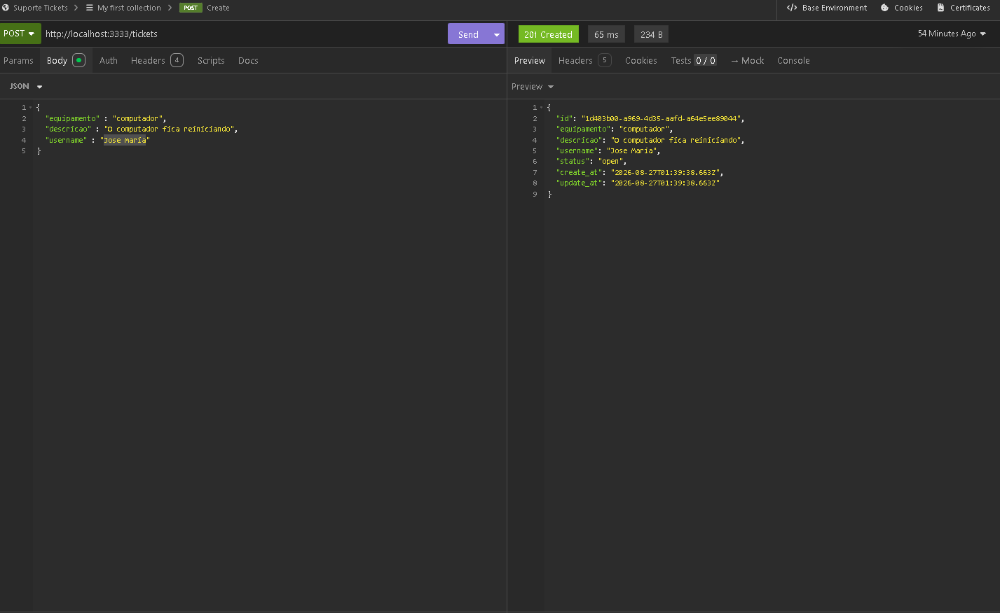
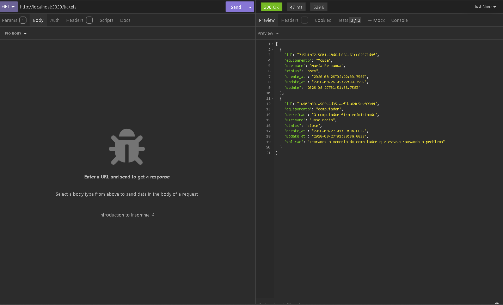

# Gerenciador de Ticket de Suporte

API REST para abertura e gerenciamento de chamados de suporte técnico, construída **sem frameworks** — usando apenas o módulo nativo `http` do Node.js.

Este projeto foi desenvolvido durante um curso de Node.js que estou assistindo, como prática de conceitos de roteamento HTTP nativo, middlewares e persistência de dados sem uso de frameworks. Voltei ao código depois para reforçar entendimento e documentar as decisões de arquitetura.

## Funcionalidades

- Criar um ticket de suporte
- Listar tickets (com filtro opcional por status)
- Atualizar dados de um ticket
- Fechar um ticket, registrando a solução aplicada
- Remover um ticket

## Endpoints

| Método | Rota | Descrição |
|---|---|---|
| `POST` | `/tickets` | Cria um novo ticket |
| `GET` | `/tickets` | Lista todos os tickets. Aceita `?status=open` como filtro |
| `PUT` | `/tickets/:id` | Atualiza equipamento e descrição de um ticket |
| `PATCH` | `/tickets/:id/close` | Fecha o ticket e registra a solução |
| `DELETE` | `/tickets/:id` | Remove um ticket |

## Exemplos de uso

### Criar ticket

```http
POST /tickets
Content-Type: application/json

{
  "equipamento": "computador",
	"descricao": "O computador fica reiniciando",
	"username": "Jose Maria",
}
```



### Listar tickets

```http
GET /tickets
```




## Arquitetura

O projeto implementa, do zero, as peças que um framework normalmente entrega prontas:

- **Roteador baseado em regex** (`utils/parseRoutePath.js`): converte rotas com parâmetros dinâmicos (`/tickets/:id`) em expressões regulares com grupos nomeados, permitindo capturar `id` e a query string a partir da própria URL.
- **Middleware de body parsing** (`middlewares/jsonHandler.js`): lê a requisição em stream (chunks), monta o buffer completo e faz o parse do JSON manualmente — o que o `express.json()` faz de forma automática.
- **Dispatcher de rotas** (`middlewares/routeHandler.js`): recebe a requisição, encontra a rota correspondente (por método + regex), popula `req.params` e `req.query`, e injeta `database` no controller.
- **Camada de persistência simples** (`database/database.js`): banco de dados baseado em arquivo JSON (`db.json`), com operações de `insert`, `select` (com filtro), `update` e `delete`, persistindo em disco a cada escrita.
- **Controllers isolados por ação** (`controllers/tickets/`): cada endpoint tem seu próprio arquivo, recebendo `req`, `res` e `database` como dependências explícitas.

```
src/
├── controllers/tickets/   # Lógica de cada endpoint (create, index, update, updateStatus, remove)
├── database/              # Camada de persistência (JSON file-based)
├── middlewares/           # Body parser e roteador
├── routes/                # Definição das rotas
├── utils/                 # Parser de rota (regex) e de query string
└── server.js              # Ponto de entrada (http.createServer)
```

## Tecnologias

- Node.js (módulo nativo `http`, `fs/promises`, `crypto`)
- Nenhuma dependência externa — framework, roteador e parser de JSON são implementações próprias

## Como rodar

```bash
git clone https://github.com/pedrobenevidesx/gerenciador-ticket-de-suporte.git
cd gerenciador-ticket-de-suporte
npm run dev
```

O servidor sobe em `http://localhost:3333`.
